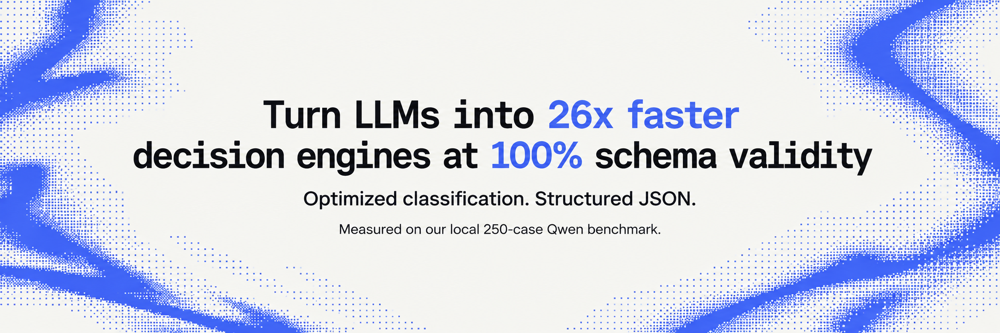
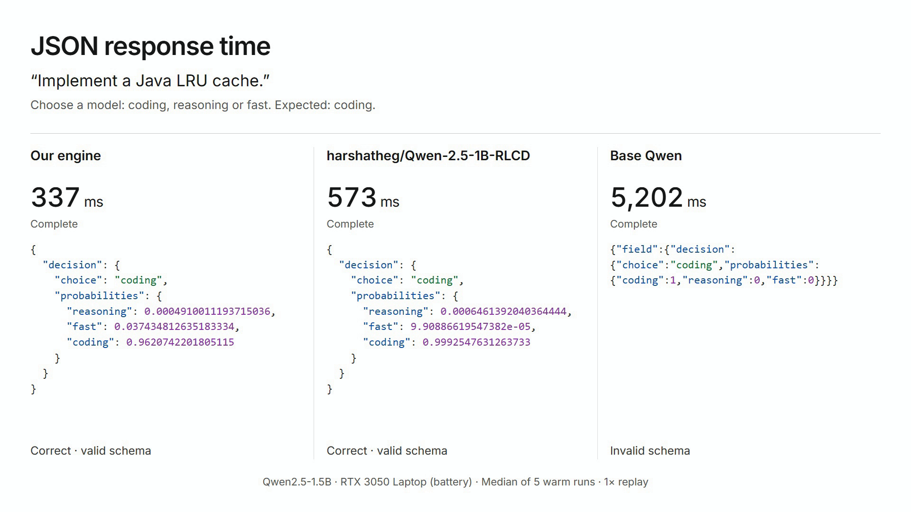

<p align="center"></p>

<h1 align="center">Subset</h1>

<p align="center">
  <a href="https://huggingface.co/harshatheg/Qwen-2.5-1B-RLCD">
    
  </a>
</p>

**26.1× faster than standard Qwen JSON generation, 2.4× faster than the HF implementation, and 100% JSON schema validity** in our [local 250-case development benchmark](#local-benchmark). Speedups compare median request latency on the same laptop and checkpoint; they are not universal performance guarantees.

Subset runs classification, yes/no judgments, and rubric scoring with an existing LLM. It reuses shared context, evaluates independent questions in batches, and constructs JSON directly from model scores. Optional GPU kernels reduce execution overhead. The default model is **Qwen2.5-1.5B-Instruct**; no fine-tuning is required.

> **Experimental project:** Subset is not affiliated with TypeSafe AI and is not intended to replace or compete with Jev. It explores a different approach: optimizing inference around an existing pretrained LLM. TypeSafe describes Jev as a purpose-built model with a new architecture and Reinforcement Learning for Calibrated Decisions (RLCD). Subset does not reproduce that architecture or training method, and its probabilities are uncalibrated. See [TypeSafe's announcement](https://typesafe.ai/blog/introducing-system-one-models-and-jev).

## Watch the comparison

[](https://github.com/sparset/subset/blob/main/docs/media/subset-comparison.mp4)

[Play the comparison video](https://github.com/sparset/subset/blob/main/docs/media/subset-comparison.mp4).

**[Download the video](https://github.com/sparset/subset/raw/refs/heads/main/docs/media/subset-comparison.mp4)** · 11 seconds · Real-time replay of recorded outputs.

One successful routing example, using each method's median of five warmed runs. These timings are separate from the 250-case benchmark below. [Recording details](docs/media/README.md).

## How the optimizations work

| Optimization | In plain language |
|---|---|
| **Reuse shared context** | Process the common input once and reuse its KV cache across question branches, instead of rereading it for every question. |
| **Score questions in parallel batches** | Evaluate independent fields together. Large sets are split into batches to control memory use. |
| **Score only the allowed answers** | For single-token answers, compute scores for the needed options instead of the whole vocabulary, then assemble JSON in code. This avoids generating JSON token by token. |
| **Use efficient GPU operations** | PyTorch's optimized attention and optional custom Triton kernels reduce intermediate memory transfers by combining neighboring calculations. |
| **Avoid wasted work between branches** | Eligible batches share one physical context cache, use attention specialized for short question branches, and group similar lengths to reduce padding. |

CUDA graphs are an additional option for repeatedly running the same input shapes. They are **off by default** because capture overhead made them slower in this benchmark. The base model's weights are unchanged; the changes are in prompting, scoring, and execution.

The 250-case test below uses one decision per request, so its gains do not demonstrate the multi-question caching or parallel scaling benefits. [Optimization details and setup](docs/optimizations.md).

## Local benchmark

250 single-decision cases, using the same **Qwen2.5-1.5B-Instruct** checkpoint in FP16 on an **RTX 3050 Laptop GPU (4 GB)** under WSL/Linux. Latency excludes model loading.

| Configuration | Correct + schema-valid | JSON schema validity | Median latency |
|---|---:|---:|---:|
| Standard Qwen, unconstrained JSON generation | 9.2% | 14% | 4,359 ms |
| Qwen-2.5-1B-RLCD, PyTorch/CUDA implementation | 74.8% | 100% | 408 ms |
| Subset, CUDA graphs enabled | 90.0% | 100% | 951 ms |
| **Subset, CUDA graphs disabled** | **90.0%** | **100%** | **167 ms** |

- **Correct + schema-valid** requires both the right choice and valid complete JSON, including probabilities for every option. The standard model's 9.2% is not its standalone classification accuracy; formatting failures count too.
- These are **development-set results**: some cases were used during prompt tuning. One timed request per case, with methods measured in separate blocks. The 100% schema result applies to these tested cases; valid structure does not guarantee correct decisions.
- All cases contain one decision, so this test does not measure multi-field parallel scaling. These are our local CUDA measurements, not the HF project's published Apple Silicon results. Jev was not benchmarked.

The 167 ms configuration used optional RMSNorm, SwiGLU, and RoPE kernels; CUDA graphs were off. See [benchmark methodology](docs/benchmarks.md) for dataset details, exact settings, and limitations, and [optimization setup](docs/optimizations.md) to enable the optional kernels.

## Install

Install `subset`, run the `subset` command, or import `subset` in Python.

Requires **Python 3.11+**. NVIDIA CUDA is recommended for speed; CPU execution is also supported.

```bash
git clone https://github.com/sparset/subset.git
cd subset
python -m venv .venv
```

Activate the environment:

- **Windows PowerShell:** `.\.venv\Scripts\Activate.ps1`
- **Linux / macOS:** `source .venv/bin/activate`

For NVIDIA GPUs, install a compatible [CUDA-enabled PyTorch build](https://pytorch.org/get-started/locally/) first. Then install Subset:

```bash
python -m pip install -e ".[inference]"
```

## Base model and downloads

The default is **`Qwen/Qwen2.5-1.5B-Instruct`**, the existing instruction-tuned Qwen model used in our benchmarks. Subset adds an inference engine around it; it does not ship newly trained model weights. In the benchmark, "standard Qwen" means this same checkpoint generating JSON normally.

**The Qwen model is not uploaded to this GitHub repository.** On first use, Transformers downloads its weights and tokenizer from Hugging Face (roughly 3 GB) and saves them in the local Hugging Face cache. Later runs reuse that download. Inference runs on your machine, without a hosted model endpoint.

Set `HF_HOME` to choose the cache folder. Once the files are downloaded, `--local-files-only` requires cached files instead of downloading them again. Internet access and any required model permissions are needed for the first download.


## Configure your workflow

Edit **[workflow.json](workflow.json)** to define the questions and allowed answers:

| Type | Purpose |
|---|---|
| `choice` | Pick from named options, such as a department or model route. |
| `noul` | Evaluate a yes/no question and return a probability. |
| `score` | Score the input against an ordered rubric. |

The included workflow demonstrates refund triage. Replace its questions and criteria for your application. Keep the rubric in the file and supply fresh context or conversation history with each request.

To use a different rubric, pass `--workflow path/to/workflow.json`. See [dynamic inputs and routing examples](docs/dynamic-inputs.md) for prompt overrides, request files, and conversation history.

## Try it

From the repository folder:

```bash
subset --interactive
```

Once the model is ready, enter a message and finish with `/run` on its own line:

```text
I was charged twice. Please refund the duplicate charge.
/run
```

Press Enter at each question prompt to use the saved instructions. Subset prints JSON, then waits for another request. Type `/quit` to exit.

For a single request:

```bash
subset --context "I was charged twice. Please refund the duplicate charge."
```

Use `--device cuda` or `--device cpu` to select a device. `python -m subset` works as an alternative to the `subset` command.

## Using another model

Subset supports specific model architectures, **not every LLM or model size**.

| Model or setup | Current support |
|---|---|
| Qwen2.5-1.5B-Instruct | Validated checkpoint and source of the published local results. |
| Other dense Qwen2, Qwen3, and Llama-style checkpoints | Accepted by the ordinary engine when architecture, tokenizer, and output head are compatible. Each checkpoint needs its own accuracy and latency checks. |
| Custom fused kernels and shared-attention kernels | Restricted to the tested dense Qwen2 Linux/CUDA setup and compatible versions/shapes. Ordinary-engine compatibility does not imply custom-kernel compatibility. |
| Other architectures, mixture-of-experts models, GGUF/Ollama endpoints, quantized wrappers, or multi-GPU/offloaded models | Not supported by the current engine. |

For a compatible checkpoint, replace `organization/model-name` with its Hugging Face model ID:

```bash
subset --model organization/model-name --interactive
```

Or load a local Transformers model folder:

```bash
subset --model ./my-model --local-files-only --interactive
```

In Python, pass the same ID or folder to `DecisionEngine.from_pretrained("organization/model-name", device="auto")`.

The model and its working memory must fit on one CPU or CUDA device. Start with the default execution settings, then test the decisions and speed on your own workflow before enabling model-specific optimizations. The default answer encoding requires distinct single-token A–Z IDs; `--answer-encoding labels` offers full-label scoring for other tokenizers, potentially at higher latency. The model still needs a compatible chat template and architecture.

Changing `workflow.json` changes the task and allowed answers; it cannot add support for a new model architecture. Unsupported families require code adapters for the model, attention/cache handling, and output scoring, plus correctness tests. A fine-tuned or merged checkpoint can work if it retains a supported architecture. See [technical compatibility and limits](docs/decision-engine.md).

## Use in Python

```python
from subset import Workflow
from subset.engine import DecisionEngine

engine = DecisionEngine.from_pretrained(device="auto")
workflow = Workflow.load("workflow.json")

result = workflow.run(
    engine,
    context="I was charged twice. Please refund the duplicate charge.",
)
print(result["answers"])
```

Keep the engine loaded between requests to avoid repeated model startup.

## Performance and limits

- Shared-context caching and batched question scoring are built in. Eligible Linux/CUDA configurations can use specialized shared-attention kernels.
- Additional Triton kernels are opt-in and require Linux/WSL, CUDA, and the tested Qwen2 setup. CUDA graphs are also opt-in; they can help repeated shapes but add capture overhead. See [optimization setup](docs/optimizations.md) and [branch execution](docs/branch-optimizations.md).
- Scores are **uncalibrated model probabilities**, not guarantees of correctness. Valid JSON can still contain a wrong decision.
- Qwen2.5-1.5B is the validated checkpoint. Other supported Qwen3/Llama backbones need their own verification. The engine currently uses one device and does not provide multi-GPU serving or quantization.

See the [technical guide](docs/decision-engine.md) for supported limits and the [answer-scoring guide](docs/literal-labels.md) for decoding options.

## Development

```bash
python -m unittest discover -s tests -p "test*.py" -v
```

GPU/Triton checks skip when their requirements are unavailable. Historical benchmark checks require local archived data and skip in a fresh checkout. Scripts under `scripts/` include experiments that depend on those local artifacts.

Downloaded weights, environments, raw benchmark outputs, and the video workspace are excluded from Git.
